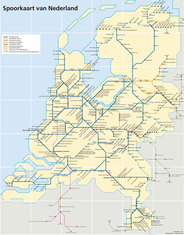
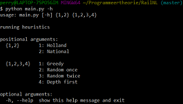

# RailNL
This README.md gives a short explanation about the RailNL case.

### Getting Started

#### Assignment
The assignment of this project is to create an algorithm within python that generates a lining system for intercity trains with the goal to optimize the overall quality of the train lining system. This can be done by maximizing the objective function given in the excercise. The objective function can be described as follows: K = p * 10000 - (T * 100 + Min), where K is the quality of the train lining system, p is a fraction of the amount of used connections, T is the amount of used pathways and Min is the total time in minutes of all used pathways. There are two conditions that have to be met when creating a train lining system. The first one is that a pathway has a maximum time length and the second condition is that a train lining system has a maximum number of pathways.

#### Method
The methods and heuristics which are used to create a solution are described in the README.md files in the "part/code" folders.

#### Prerequisites
The code is fully written in python. The file 'requirements.txt' contains all packages to run the program succesfully. These packages are easy installable with the following instruction:
<pre> pip install -r requirements.txt </pre>

#### Testing
To run the code, use the following instruction:
<pre> python main.py -h </pre>

After running this command, the user gets prompted to make a decision which area he/she wants to
use for the heuristic and what heuristic he/she wants to use. 
An example of what the user can expect can be seen in the image below.

#### Attachment
The Attachment folder contains files we received from the minor to get started with the project. 

### Authors
Team name: **PGT Party**

Team members:
* Gaby Hageman
* Perry Plooij
* Tom van Rooijen

### Acknowledgement
We want to thank Nigel and Reitze for helping us throughout the course of the project. We also want to thank our fellow students for attending our presentation and providing us with feedback, tips and ideas.

